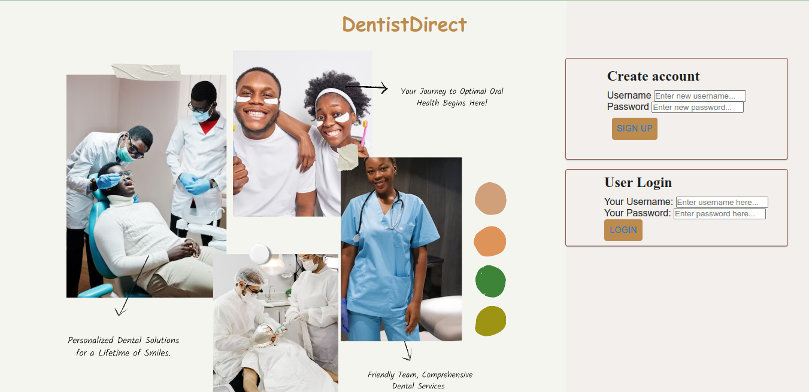

# Introducing DentistDirect: Simplifying Your Dental Care Journey

## Description

DentistDirect is a user-friendly application designed to streamline and enhance your dental care experience. With DentistDirect, you can effortlessly manage your dental appointments, explore a wide range of skilled dentists, and access their specialties. Our platform is here to ensure that your oral health is in excellent hands, providing convenience and flexibility every step of the way.

## Key Features:

- User Account Creation: Easily create a personal account within minutes to enjoy the full benefits of DentistDirect. Your account gives you access to personalized features and securely stores your information.

- Secure Login: Log in to your DentistDirect account with confidence, knowing that your data is protected. Our robust authentication system ensures the privacy and security of your sensitive information.

- Discover Skilled Dentists and Specialties: Explore a comprehensive directory of qualified dentists along with their areas of specialization. Whether you require a routine cleaning, orthodontic treatment, or cosmetic dentistry, DentistDirect has you covered.

- Schedule Appointments: Seamlessly schedule appointments with your preferred dentist through our intuitive and user-friendly interface. Choose the date and time that suits you best, with real-time availability updates.

- Manage Appointments: DentistDirect empowers you to make changes or cancel your appointments hassle-free. Life can be unpredictable, and we understand the need for flexibility. Simply log in to your account, make the necessary adjustments, and stay in control of your dental care journey.

- Personalized Recommendations: Receive personalized recommendations based on your dental needs, previous appointments, and preferences. We strive to ensure that your dental care aligns perfectly with your unique requirements.

- Notifications and Reminders: Stay informed and never miss an appointment with our automated notification and reminder system. DentistDirect sends timely alerts to keep you updated about upcoming appointments and any changes.

- Experience the Future of Dental Care with DentistDirect:
At DentistDirect, our mission is to revolutionize the way you approach dental care. With our user-centric approach and advanced features, we aim to make your dental journey more convenient, efficient, and pleasant. Join us today and take control of your oral health with DentistDirect.

## Requirements

- Ruby 2.7.4
- NodeJS (v16), and npm
- Render account
- SQlite3

See Environment Setup below for instructions on installing these tools if you
don't already have them.

## Setup and Installation

Start by **cloning** (not forking) the project repository;

```console
$ git clone https://github.com/EdPaul1/DentistDirect.git
$ cd DentistDirect
$ bundle install
$ npm install --prefix client
$ rails s # This will start the server
$ npm start --prefix client # Note: export NODE_OPTIONS=--openssl-legacy-provider  before running npm start incase you find issues starting the frontend
```
## Getting Started

Sign Up for an account using your credentials of choice and Join us today and take control of your Oral health with DentistDirect.

## License
   This project is licensed under the MIT License